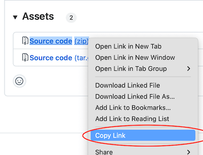
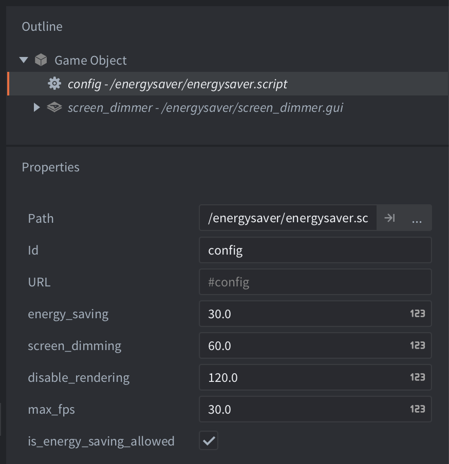

# Energy Saver
This extension can help reduce power consumption in your Defold game. This is especially useful on handheld devices where reduced power consumption will improve the player experience as the battery lasts longer. It also helps to avoid overheating and reduces both the player's energy bill and the game's carbon footprint.

## How is power consumption reduced?
The extension offers reduction in power consumption in the following ways:

- Reduced FPS
- Screen dimming
- Disabled rendering

### Reduced FPS
Adding an adjustable frame limit doesn’t take much time and is one of the most effective ways to limit power consumption. In a [case study by Microsoft](https://learn.microsoft.com/en-us/xbox/sustainability/case-studies/case-studies-halo) they found that reducing the FPS from 60 to 30 in the Halo Infinite Armor Hall menu on Xbox resulted in an overall power saving of 37.5%.

### Screen dimming
Screens use power, so screen dimming is useful for OLED screens, as they can actually reduce power consumption if displayed image is darker (while classic LCD screens mostly use the same amount of energy). According to a [report by SGA](https://sustainablegamesalliance.org/wp-content/uploads/2026/03/03-26-SGA-Energy-Efficiency-Guide.pdf) dimming the screen when inactive can save up to 15 watts on OLED laptops. Also, Google has measured the impact of dimming OLED screens on Android devices and found that Dark Mode can result in up to 60% less display power ([source](https://www.youtube.com/watch?v=N_6sPd0Jd3g)).

### Disabled rendering
Microsoft's Xbox sustainability guidance explicitly recommends not rendering when nothing on screen changes, because rendering is one of the dominant consumers of power. Their Halo Infinite case study reports large reductions simply by reducing rendering activity in menus, and recommends going further by suspending rendering entirely when possible (for example, during inactive screens).


## Installation
To use this extension in your Defold project, add the needed version URL to your game.project dependencies from [Releases](https://github.com/defold/extension-energy-saver/releases):




## Usage
Drag the `energysaver.go` into your main/bootstrap collection, expand the game object in the Outline panel and select the `energysaver.script` to expose the configurable values:



* `energy_saving` number of seconds of inactivity before FPS is reduced to `max_fps`. Set to 0 to disable this option. FPS is reduced by calling `sys.set_update_frequency()`.
* `screen_dimming` number of seconds of inactivity before dimming the screen by 50%. Set to 0 to disable this option. Screen dimming is achieved by overlaying a black box node with 50% alpha.
* `disable_rendering` number of seconds of inactivity before rendering is completely disabled. Set to 0 to disable this option. Rendering is disabled using `sys.set_render_enabled()`.
* `is_energy_saving_allowed` set to false to disable power saving measures. This can be used to temporarily disable power saving during cutscenes or similar:

```lua
-- disable power saving measures
go.set("/energysaver#config", "is_energy_saving_allowed", false)
-- enable power saving measures
go.set("/energysaver#config", "is_energy_saving_allowed", true)
```

## Sustainable Games Alliance
The extension is created in collaboration with the [Sustainable Games Alliance](https://sustainablegamesalliance.org/). 
